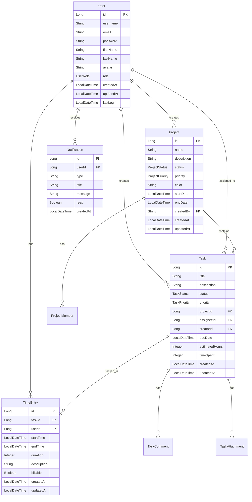

# Task Management Platform - Backend Roadmap

## Executive Summary

**Current State**: Spring Boot 3.x backend with comprehensive authentication, user management, and basic project management. The database schema includes tables for tasks, time entries, and notifications, but the corresponding backend APIs are missing.

**Frontend Analysis**: Angular 17 frontend with 8 main feature modules requiring extensive backend support:
- ✅ **Authentication & User Management**: Fully implemented
- ✅ **Project Management**: Basic CRUD implemented  
- ❌ **Task Management**: Database exists, APIs missing (CRITICAL)
- ❌ **Time Tracking**: Database exists, APIs missing (CRITICAL)
- ❌ **Analytics Dashboard**: No backend support (HIGH)
- ❌ **Real-time Features**: No WebSocket implementation (HIGH)
- ❌ **Search & Filtering**: No global search APIs (MEDIUM)
- ❌ **Notifications**: Database exists, APIs missing (MEDIUM)

**Critical Gaps**: 4 critical backend API gaps preventing frontend functionality
**Estimated Effort**: 16-18 weeks for complete backend implementation
**Risk Level**: HIGH - Frontend is ready but backend APIs are missing

---

## Page-Action-API Matrix

| Page | UI Action | Required Endpoint | Method | Request DTO | Response DTO | AuthZ | Status |
|------|-----------|-------------------|--------|-------------|-------------|-------|--------|
| **Authentication** |
| `/auth/login` | Login | `/api/auth/login` | POST | LoginRequest | LoginResponse | None | ✅ Done |
| `/auth/register` | Register | `/api/auth/register` | POST | RegisterRequest | LoginResponse | None | ✅ Done |
| `/auth/forgot-password` | Forgot Password | `/api/auth/forgot-password` | POST | ForgotPasswordRequest | MessageResponse | None | ✅ Done |
| **Dashboard** |
| `/dashboard` | Load Dashboard | `/api/analytics/dashboard` | GET | - | DashboardAnalytics | User | ❌ Missing |
| `/dashboard` | Load Recent Activity | `/api/analytics/recent-activity` | GET | - | ActivityFeed | User | ❌ Missing |
| **Projects** |
| `/projects` | List Projects | `/api/projects` | GET | - | ProjectDto[] | User | ✅ Done |
| `/projects` | Create Project | `/api/projects` | POST | CreateProjectRequest | ProjectDto | User | ✅ Done |
| `/projects` | Update Project | `/api/projects/{id}` | PUT | UpdateProjectRequest | ProjectDto | User | ✅ Done |
| `/projects` | Delete Project | `/api/projects/{id}` | DELETE | - | MessageResponse | User | ✅ Done |
| `/projects` | Search Projects | `/api/projects/search` | GET | SearchRequest | ProjectDto[] | User | ❌ Missing |
| `/projects` | Filter Projects | `/api/projects/filter` | GET | ProjectFilters | ProjectDto[] | User | ❌ Missing |
| **Tasks** |
| `/tasks` | List Tasks | `/api/tasks` | GET | - | TaskDto[] | User | ❌ Missing |
| `/tasks` | Create Task | `/api/tasks` | POST | CreateTaskRequest | TaskDto | User | ❌ Missing |
| `/tasks` | Update Task | `/api/tasks/{id}` | PUT | UpdateTaskRequest | TaskDto | User | ❌ Missing |
| `/tasks` | Delete Task | `/api/tasks/{id}` | DELETE | - | MessageResponse | User | ❌ Missing |
| `/tasks` | Assign Task | `/api/tasks/{id}/assign` | PUT | AssignTaskRequest | TaskDto | User | ❌ Missing |
| `/tasks` | Change Status | `/api/tasks/{id}/status` | PUT | ChangeStatusRequest | TaskDto | User | ❌ Missing |
| `/tasks` | Search Tasks | `/api/tasks/search` | GET | SearchRequest | TaskDto[] | User | ❌ Missing |
| `/tasks` | Filter Tasks | `/api/tasks/filter` | GET | TaskFilters | TaskDto[] | User | ❌ Missing |
| **Time Tracking** |
| `/time-tracking` | List Time Entries | `/api/time-entries` | GET | - | TimeEntryDto[] | User | ❌ Missing |
| `/time-tracking` | Create Time Entry | `/api/time-entries` | POST | CreateTimeEntryRequest | TimeEntryDto | User | ❌ Missing |
| `/time-tracking` | Start Timer | `/api/timer/start` | POST | StartTimerRequest | TimerDto | User | ❌ Missing |
| `/time-tracking` | Stop Timer | `/api/timer/stop` | POST | - | TimeEntryDto | User | ❌ Missing |
| `/time-tracking` | Get Timer Status | `/api/timer/status` | GET | - | TimerDto | User | ❌ Missing |
| `/time-tracking` | Export Time | `/api/time-entries/export` | GET | ExportRequest | FileResponse | User | ❌ Missing |
| **Analytics** |
| `/analytics` | Dashboard Metrics | `/api/analytics/dashboard` | GET | - | DashboardAnalytics | User | ❌ Missing |
| `/analytics` | Project Analytics | `/api/analytics/projects` | GET | - | ProjectAnalytics[] | User | ❌ Missing |
| `/analytics` | Task Analytics | `/api/analytics/tasks` | GET | - | TaskAnalytics | User | ❌ Missing |
| `/analytics` | Time Analytics | `/api/analytics/time` | GET | - | TimeAnalytics | User | ❌ Missing |
| `/analytics` | Team Performance | `/api/analytics/team` | GET | - | TeamPerformance | User | ❌ Missing |
| `/analytics` | Export Reports | `/api/analytics/export` | GET | ExportRequest | FileResponse | User | ❌ Missing |
| **Settings** |
| `/settings/profile` | Get Profile | `/api/profile` | GET | - | ProfileResponse | User | ✅ Done |
| `/settings/profile` | Update Profile | `/api/profile` | PUT | UpdateProfileRequest | ProfileResponse | User | ✅ Done |
| `/settings/profile` | Upload Avatar | `/api/profile/avatar` | POST | MultipartFile | AvatarResponse | User | ✅ Done |
| `/settings/notifications` | Get Notifications | `/api/notifications` | GET | - | NotificationDto[] | User | ❌ Missing |
| `/settings/notifications` | Update Settings | `/api/notifications/settings` | PUT | NotificationSettings | MessageResponse | User | ❌ Missing |
| **Search** |
| Global Search | Search All | `/api/search` | GET | SearchRequest | SearchResult[] | User | ❌ Missing |
| Global Search | Search Tasks | `/api/search/tasks` | GET | SearchRequest | TaskDto[] | User | ❌ Missing |
| Global Search | Search Projects | `/api/search/projects` | GET | SearchRequest | ProjectDto[] | User | ❌ Missing |

---

## Current Backend Status Matrix

| Component | Status | Implementation Details | Files | Gaps |
|-----------|--------|----------------------|-------|------|
| **Controllers** |
| AuthController | ✅ Complete | Login, register, refresh | `AuthController.java` | Rate limiting |
| ProfileController | ✅ Complete | Profile CRUD, avatar upload | `ProfileController.java` | None |
| ProjectController | ✅ Complete | Basic CRUD operations | `ProjectController.java` | Search, filtering |
| TaskController | ❌ Missing | No task management APIs | - | **CRITICAL GAP** |
| TimeTrackingController | ❌ Missing | No time tracking APIs | - | **CRITICAL GAP** |
| AnalyticsController | ❌ Missing | No analytics APIs | - | **HIGH GAP** |
| NotificationController | ❌ Missing | No notification APIs | - | **MEDIUM GAP** |
| SearchController | ❌ Missing | No search APIs | - | **MEDIUM GAP** |
| **Services** |
| AuthService | ✅ Complete | JWT, WebAuthn, OAuth2 | `AuthService.java` | Rate limiting |
| ProfileService | ✅ Complete | Profile management | `ProfileService.java` | None |
| ProjectService | ✅ Complete | Basic project operations | `ProjectService.java` | Advanced features |
| TaskService | ❌ Missing | No task service | - | **CRITICAL GAP** |
| TimeTrackingService | ❌ Missing | No time tracking service | - | **CRITICAL GAP** |
| AnalyticsService | ❌ Missing | No analytics service | - | **HIGH GAP** |
| NotificationService | ❌ Missing | No notification service | - | **MEDIUM GAP** |
| SearchService | ❌ Missing | No search service | - | **MEDIUM GAP** |
| **Entities** |
| User | ✅ Complete | Full user entity | `UserEntity.java` | None |
| Project | ✅ Complete | Project entity | `Project.java` | Team management |
| Task | ❌ Missing | No task entity | - | **CRITICAL GAP** |
| TimeEntry | ❌ Missing | No time entry entity | - | **CRITICAL GAP** |
| Notification | ❌ Missing | No notification entity | - | **MEDIUM GAP** |
| **Repositories** |
| UserRepository | ✅ Complete | User CRUD operations | `UserRepository.java` | None |
| ProjectRepository | ✅ Complete | Project queries | `ProjectRepository.java` | Advanced queries |
| TaskRepository | ❌ Missing | No task repository | - | **CRITICAL GAP** |
| TimeEntryRepository | ❌ Missing | No time entry repository | - | **CRITICAL GAP** |
| NotificationRepository | ❌ Missing | No notification repository | - | **MEDIUM GAP** |
| **Cross-cutting** |
| Security | ⚠️ Partial | Spring Security, JWT | `SecurityConfig.java` | Rate limiting, audit |
| Validation | ✅ Complete | Bean validation | DTOs | None |
| Error Handling | ✅ Complete | Global exception handler | `GlobalExceptionHandler.java` | Structured logging |
| Logging | ⚠️ Partial | Basic logging | - | Structured logging |
| Metrics | ⚠️ Partial | Micrometer setup | `MicrometerConfig.java` | Dashboards, alerts |
| Caching | ❌ Missing | No caching | - | Redis integration |
| **Database** |
| Schema | ✅ Complete | All tables exist | Migrations | Indexes, performance |
| Migrations | ✅ Complete | Liquibase setup | `db/changelog/` | Performance tuning |
| **DevOps** |
| Testing | ❌ Incomplete | Basic unit tests | Test classes | Integration, E2E |
| CI/CD | ❌ Missing | No pipeline | - | Automated deployment |
| Monitoring | ⚠️ Partial | Basic setup | - | Dashboards, alerts |

---

## Phased Backend Roadmap

### Phase 0: Critical APIs (4-5 weeks)
**Goal**: Implement essential APIs to support frontend functionality

#### Week 1-2: Task Management APIs
- [ ] **P0.1** Create Task entity and repository
  - **Acceptance Criteria**: Task entity with all fields, repository with CRUD operations
  - **Files**: `Task.java`, `TaskRepository.java`
  - **Effort**: Medium
  - **Dependencies**: None

- [ ] **P0.2** Implement Task CRUD operations
  - **Acceptance Criteria**: GET/POST/PUT/DELETE `/api/tasks` endpoints
  - **Files**: `TaskController.java`, `TaskService.java`
  - **Effort**: Large
  - **Dependencies**: P0.1

- [ ] **P0.3** Add task filtering and search
  - **Acceptance Criteria**: Filter by status, assignee, project; search by title/description
  - **Files**: `TaskService.java` (enhanced)
  - **Effort**: Medium
  - **Dependencies**: P0.2

- [ ] **P0.4** Implement task assignment
  - **Acceptance Criteria**: Assign/unassign tasks, get tasks by assignee
  - **Files**: `TaskService.java` (enhanced)
  - **Effort**: Small
  - **Dependencies**: P0.2

- [ ] **P0.5** Add task status management
  - **Acceptance Criteria**: Change task status, get tasks by status, status validation
  - **Files**: `TaskService.java` (enhanced)
  - **Effort**: Small
  - **Dependencies**: P0.2

#### Week 3-4: Time Tracking APIs
- [ ] **P0.6** Create TimeEntry entity and repository
  - **Acceptance Criteria**: TimeEntry entity, repository with CRUD operations
  - **Files**: `TimeEntry.java`, `TimeEntryRepository.java`
  - **Effort**: Medium
  - **Dependencies**: None

- [ ] **P0.7** Implement time entry CRUD
  - **Acceptance Criteria**: GET/POST/PUT/DELETE `/api/time-entries` endpoints
  - **Files**: `TimeEntryController.java`, `TimeEntryService.java`
  - **Effort**: Large
  - **Dependencies**: P0.6

- [ ] **P0.8** Add timer functionality
  - **Acceptance Criteria**: Start/stop timer, get timer status, timer persistence
  - **Files**: `TimerService.java`, `TimerController.java`
  - **Effort**: Medium
  - **Dependencies**: P0.7

- [ ] **P0.9** Create time reports and analytics
  - **Acceptance Criteria**: Time reports, analytics, billable time tracking
  - **Files**: `TimeEntryService.java` (enhanced)
  - **Effort**: Medium
  - **Dependencies**: P0.7

#### Week 5: Basic Analytics
- [ ] **P0.10** Create analytics service
  - **Acceptance Criteria**: Analytics service with basic metrics calculation
  - **Files**: `AnalyticsService.java`
  - **Effort**: Medium
  - **Dependencies**: P0.2, P0.7

- [ ] **P0.11** Implement dashboard metrics
  - **Acceptance Criteria**: GET `/api/analytics/dashboard` endpoint
  - **Files**: `AnalyticsController.java`
  - **Effort**: Medium
  - **Dependencies**: P0.10

- [ ] **P0.12** Add project analytics
  - **Acceptance Criteria**: GET `/api/analytics/projects` endpoint
  - **Files**: `AnalyticsController.java` (enhanced)
  - **Effort**: Medium
  - **Dependencies**: P0.11

### Phase 1: Real-time Features (3-4 weeks)
**Goal**: Implement real-time communication and notifications

#### Week 1-2: WebSocket Implementation
- [ ] **P1.1** Configure WebSocket support
  - **Acceptance Criteria**: WebSocket configuration, connection management
  - **Files**: `WebSocketConfig.java`
  - **Effort**: Medium
  - **Dependencies**: None

- [ ] **P1.2** Implement task update notifications
  - **Acceptance Criteria**: Real-time task status updates, assignment notifications
  - **Files**: `TaskNotificationService.java`
  - **Effort**: Medium
  - **Dependencies**: P1.1, P0.2

- [ ] **P1.3** Add project update notifications
  - **Acceptance Criteria**: Real-time project changes, team member updates
  - **Files**: `ProjectNotificationService.java`
  - **Effort**: Medium
  - **Dependencies**: P1.1

- [ ] **P1.4** Create time tracking notifications
  - **Acceptance Criteria**: Timer start/stop notifications, time entry updates
  - **Files**: `TimeTrackingNotificationService.java`
  - **Effort**: Medium
  - **Dependencies**: P1.1, P0.7

#### Week 3-4: Notification System
- [ ] **P1.5** Create notification entity
  - **Acceptance Criteria**: Notification entity, repository with CRUD operations
  - **Files**: `Notification.java`, `NotificationRepository.java`
  - **Effort**: Small
  - **Dependencies**: None

- [ ] **P1.6** Implement notification service
  - **Acceptance Criteria**: GET/POST/PUT `/api/notifications` endpoints
  - **Files**: `NotificationController.java`, `NotificationService.java`
  - **Effort**: Medium
  - **Dependencies**: P1.5

- [ ] **P1.7** Add email notifications
  - **Acceptance Criteria**: Email notification service, task assignment emails
  - **Files**: `EmailNotificationService.java`
  - **Effort**: Medium
  - **Dependencies**: P1.6

### Phase 2: Advanced Features (4-5 weeks)
**Goal**: Implement advanced functionality and integrations

#### Week 1-2: Advanced Search
- [ ] **P2.1** Implement global search
  - **Acceptance Criteria**: GET `/api/search` endpoint, search across all entities
  - **Files**: `SearchController.java`, `SearchService.java`
  - **Effort**: Medium
  - **Dependencies**: P0.2

- [ ] **P2.2** Add search filters
  - **Acceptance Criteria**: Advanced search filters, date range filtering
  - **Files**: `SearchService.java` (enhanced)
  - **Effort**: Medium
  - **Dependencies**: P2.1

- [ ] **P2.3** Create search suggestions
  - **Acceptance Criteria**: Auto-complete suggestions, recent searches
  - **Files**: `SearchService.java` (enhanced)
  - **Effort**: Small
  - **Dependencies**: P2.1

#### Week 3-4: Team Collaboration
- [ ] **P2.4** Add task comments
  - **Acceptance Criteria**: GET/POST/PUT/DELETE `/api/tasks/{id}/comments` endpoints
  - **Files**: `TaskComment.java`, `TaskCommentController.java`
  - **Effort**: Medium
  - **Dependencies**: P0.2

- [ ] **P2.5** Implement mentions
  - **Acceptance Criteria**: User mention detection, mention notifications
  - **Files**: `MentionService.java`
  - **Effort**: Medium
  - **Dependencies**: P2.4

- [ ] **P2.6** Create activity feeds
  - **Acceptance Criteria**: GET `/api/activity` endpoint, project/user activity tracking
  - **Files**: `ActivityService.java`, `ActivityController.java`
  - **Effort**: Medium
  - **Dependencies**: P2.4

#### Week 5: Export/Import
- [ ] **P2.7** Implement PDF export
  - **Acceptance Criteria**: Export tasks/projects/time to PDF
  - **Files**: `ExportService.java`
  - **Effort**: Medium
  - **Dependencies**: P0.2, P0.7

- [ ] **P2.8** Add Excel export
  - **Acceptance Criteria**: Export data to Excel format
  - **Files**: `ExportService.java` (enhanced)
  - **Effort**: Medium
  - **Dependencies**: P2.7

### Phase 3: Performance & Scalability (3-4 weeks)
**Goal**: Optimize performance and add scalability features

#### Week 1-2: Caching & Performance
- [ ] **P3.1** Implement Redis caching
  - **Acceptance Criteria**: Redis configuration, cache task/project data
  - **Files**: `CacheConfig.java`
  - **Effort**: Medium
  - **Dependencies**: None

- [ ] **P3.2** Add query optimization
  - **Acceptance Criteria**: Optimize database queries, add indexes
  - **Files**: Database migrations
  - **Effort**: Medium
  - **Dependencies**: P3.1

- [ ] **P3.3** Implement pagination
  - **Acceptance Criteria**: Pagination for all list endpoints
  - **Files**: All controllers (enhanced)
  - **Effort**: Small
  - **Dependencies**: P3.1

#### Week 3-4: Monitoring & Observability
- [ ] **P3.4** Add comprehensive logging
  - **Acceptance Criteria**: Structured logging, log aggregation
  - **Files**: Logging configuration
  - **Effort**: Medium
  - **Dependencies**: None

- [ ] **P3.5** Implement metrics collection
  - **Acceptance Criteria**: Application metrics, business metrics
  - **Files**: `MetricsService.java`
  - **Effort**: Medium
  - **Dependencies**: P3.4

- [ ] **P3.6** Create health checks
  - **Acceptance Criteria**: Health check endpoints, database health checks
  - **Files**: `HealthController.java`
  - **Effort**: Small
  - **Dependencies**: P3.5

### Phase 4: Testing & Quality (2-3 weeks)
**Goal**: Ensure code quality and reliability

#### Week 1-2: Test Coverage
- [ ] **P4.1** Add unit tests for all services
  - **Acceptance Criteria**: 80%+ code coverage, all service methods tested
  - **Files**: Test classes for all services
  - **Effort**: Large
  - **Dependencies**: All previous phases

- [ ] **P4.2** Implement integration tests
  - **Acceptance Criteria**: API endpoint tests, database integration tests
  - **Files**: Integration test classes
  - **Effort**: Large
  - **Dependencies**: P4.1

- [ ] **P4.3** Create API tests
  - **Acceptance Criteria**: Contract testing, API documentation tests
  - **Files**: API test classes
  - **Effort**: Medium
  - **Dependencies**: P4.2

#### Week 3: Documentation & Deployment
- [ ] **P4.4** Create API documentation
  - **Acceptance Criteria**: OpenAPI/Swagger documentation, API examples
  - **Files**: OpenAPI configuration
  - **Effort**: Medium
  - **Dependencies**: None

- [ ] **P4.5** Add deployment scripts
  - **Acceptance Criteria**: Docker deployment, database migration scripts
  - **Files**: Docker configuration, deployment scripts
  - **Effort**: Medium
  - **Dependencies**: P4.4

- [ ] **P4.6** Implement CI/CD pipeline
  - **Acceptance Criteria**: Automated testing, automated deployment
  - **Files**: CI/CD configuration
  - **Effort**: Medium
  - **Dependencies**: P4.5

---

## API Design & Contracts

### OpenAPI Specification Requirements

```yaml
openapi: 3.0.0
info:
  title: Task Management Platform API
  version: 1.0.0
  description: Comprehensive API for task and project management

paths:
  # Task Management APIs
  /api/tasks:
    get:
      summary: Get all tasks
      parameters:
        - name: status
          in: query
          schema:
            type: string
            enum: [TODO, IN_PROGRESS, IN_REVIEW, DONE, CANCELLED]
        - name: assignee
          in: query
          schema:
            type: string
        - name: project
          in: query
          schema:
            type: string
      responses:
        '200':
          description: List of tasks
          content:
            application/json:
              schema:
                type: array
                items:
                  $ref: '#/components/schemas/TaskDto'
    
    post:
      summary: Create new task
      requestBody:
        required: true
        content:
          application/json:
            schema:
              $ref: '#/components/schemas/CreateTaskRequest'
      responses:
        '201':
          description: Task created successfully
          content:
            application/json:
              schema:
                $ref: '#/components/schemas/TaskDto'

  # Time Tracking APIs
  /api/time-entries:
    get:
      summary: Get time entries
      parameters:
        - name: userId
          in: query
          schema:
            type: string
        - name: taskId
          in: query
          schema:
            type: string
        - name: startDate
          in: query
          schema:
            type: string
            format: date-time
        - name: endDate
          in: query
          schema:
            type: string
            format: date-time
      responses:
        '200':
          description: List of time entries
          content:
            application/json:
              schema:
                type: array
                items:
                  $ref: '#/components/schemas/TimeEntryDto'

  # Analytics APIs
  /api/analytics/dashboard:
    get:
      summary: Get dashboard analytics
      responses:
        '200':
          description: Dashboard analytics
          content:
            application/json:
              schema:
                $ref: '#/components/schemas/DashboardAnalytics'

components:
  schemas:
    TaskDto:
      type: object
      properties:
        id:
          type: string
          format: uuid
        title:
          type: string
        description:
          type: string
        status:
          type: string
          enum: [TODO, IN_PROGRESS, IN_REVIEW, DONE, CANCELLED]
        priority:
          type: string
          enum: [LOW, MEDIUM, HIGH, URGENT]
        projectId:
          type: string
          format: uuid
        assigneeId:
          type: string
          format: uuid
        creatorId:
          type: string
          format: uuid
        labels:
          type: array
          items:
            type: string
        timeSpent:
          type: integer
        estimatedHours:
          type: integer
        dueDate:
          type: string
          format: date-time
        createdAt:
          type: string
          format: date-time
        updatedAt:
          type: string
          format: date-time

    CreateTaskRequest:
      type: object
      required:
        - title
        - projectId
      properties:
        title:
          type: string
          minLength: 1
          maxLength: 200
        description:
          type: string
          maxLength: 1000
        projectId:
          type: string
          format: uuid
        assigneeId:
          type: string
          format: uuid
        priority:
          type: string
          enum: [LOW, MEDIUM, HIGH, URGENT]
          default: MEDIUM
        estimatedHours:
          type: integer
          minimum: 0
        dueDate:
          type: string
          format: date-time
        labels:
          type: array
          items:
            type: string

    TimeEntryDto:
      type: object
      properties:
        id:
          type: string
          format: uuid
        taskId:
          type: string
          format: uuid
        userId:
          type: string
          format: uuid
        startTime:
          type: string
          format: date-time
        endTime:
          type: string
          format: date-time
        duration:
          type: integer
          description: Duration in minutes
        description:
          type: string
        billable:
          type: boolean
          default: false
        createdAt:
          type: string
          format: date-time
        updatedAt:
          type: string
          format: date-time

    DashboardAnalytics:
      type: object
      properties:
        totalProjects:
          type: integer
        activeProjects:
          type: integer
        totalTasks:
          type: integer
        completedTasks:
          type: integer
        overdueTasks:
          type: integer
        averageCompletionTime:
          type: number
        teamProductivity:
          type: number
        recentActivity:
          type: array
          items:
            $ref: '#/components/schemas/ActivityItem'
        projectProgress:
          type: array
          items:
            $ref: '#/components/schemas/ProjectProgress'
```

---

## Domain & Data Model

### Entity Relationships



### Database Schema Updates

```sql
-- Additional indexes for performance
CREATE INDEX idx_tasks_project_id ON tasks(project_id);
CREATE INDEX idx_tasks_assignee_id ON tasks(assignee_id);
CREATE INDEX idx_tasks_status ON tasks(status);
CREATE INDEX idx_tasks_created_at ON tasks(created_at);
CREATE INDEX idx_time_entries_user_id ON time_entries(user_id);
CREATE INDEX idx_time_entries_task_id ON time_entries(task_id);
CREATE INDEX idx_time_entries_start_time ON time_entries(start_time);
CREATE INDEX idx_notifications_user_id ON notifications(user_id);
CREATE INDEX idx_notifications_read ON notifications(read);
CREATE INDEX idx_notifications_created_at ON notifications(created_at);

-- Full-text search indexes
CREATE INDEX idx_tasks_title_gin ON tasks USING gin(to_tsvector('english', title));
CREATE INDEX idx_tasks_description_gin ON tasks USING gin(to_tsvector('english', description));
CREATE INDEX idx_projects_name_gin ON projects USING gin(to_tsvector('english', name));
CREATE INDEX idx_projects_description_gin ON projects USING gin(to_tsvector('english', description));
```

---

## Quality & Operations

### Testing Plan

| Test Type | Coverage Target | Critical Paths | Tools |
|-----------|----------------|----------------|-------|
| **Unit Tests** | 80%+ | All service methods | JUnit 5, Mockito |
| **Integration Tests** | 70%+ | API endpoints, database | TestContainers, @SpringBootTest |
| **Contract Tests** | 100% | API contracts | Pact, WireMock |
| **Performance Tests** | Key endpoints | Task CRUD, time tracking | JMeter, Gatling |
| **E2E Tests** | Critical flows | User registration, task creation | Cypress, Selenium |

### CI/CD Pipeline

```yaml
name: Backend CI/CD Pipeline
on:
  push:
    branches: [ main, develop ]
  pull_request:
    branches: [ main, develop ]

jobs:
  test:
    runs-on: ubuntu-latest
    steps:
    - uses: actions/checkout@v3
    - name: Set up JDK 17
      uses: actions/setup-java@v3
      with:
        java-version: '17'
        distribution: 'temurin'
    - name: Cache Maven dependencies
      uses: actions/cache@v3
      with:
        path: ~/.m2
        key: ${{ runner.os }}-m2-${{ hashFiles('**/pom.xml') }}
    - name: Run tests
      run: ./mvnw clean test
    - name: Run integration tests
      run: ./mvnw verify
    - name: Generate test report
      run: ./mvnw jacoco:report

  security:
    runs-on: ubuntu-latest
    steps:
    - uses: actions/checkout@v3
    - name: Run security scan
      run: ./mvnw org.owasp:dependency-check-maven:check
    - name: Run SAST scan
      uses: github/super-linter@v4

  build:
    runs-on: ubuntu-latest
    needs: [test, security]
    steps:
    - uses: actions/checkout@v3
    - name: Build application
      run: ./mvnw clean package -DskipTests
    - name: Build Docker image
      run: docker build -t taskboard-api:${{ github.sha }} .
    - name: Push to registry
      run: docker push taskboard-api:${{ github.sha }}

  deploy:
    runs-on: ubuntu-latest
    needs: [build]
    if: github.ref == 'refs/heads/main'
    steps:
    - name: Deploy to production
      run: |
        # Deployment steps
        echo "Deploying to production"
```

### Observability SLOs

| Metric | Target | Measurement |
|--------|--------|-------------|
| **API Response Time** | < 200ms (95th percentile) | Prometheus, Grafana |
| **Error Rate** | < 1% | Prometheus, Grafana |
| **Availability** | > 99.9% | Uptime monitoring |
| **Database Connection Pool** | < 80% utilization | Micrometer |
| **Memory Usage** | < 80% of heap | JVM metrics |
| **CPU Usage** | < 70% average | System metrics |

### Security Checklist

- [ ] **Authentication**: JWT tokens, refresh tokens, secure storage
- [ ] **Authorization**: Role-based access control, resource-level permissions
- [ ] **Input Validation**: All endpoints validated, SQL injection prevention
- [ ] **Output Encoding**: XSS prevention, secure headers
- [ ] **Rate Limiting**: API rate limits, brute force protection
- [ ] **Secrets Management**: Environment variables, encrypted storage
- [ ] **Audit Logging**: Security events, user actions
- [ ] **HTTPS**: TLS 1.3, secure communication
- [ ] **CORS**: Proper CORS configuration
- [ ] **Content Security Policy**: CSP headers

---

## Risk Register

| Risk | Likelihood | Impact | Mitigation | Owner |
|------|------------|--------|------------|-------|
| **Missing Task APIs** | High | Critical | Prioritize in Phase 0, allocate senior developers | Backend Team |
| **Database Performance** | Medium | High | Implement caching, optimize queries, add indexes | Backend Team |
| **Real-time Complexity** | Medium | High | Use proven libraries, implement incrementally | Backend Team |
| **Time Tracking Logic** | Medium | Medium | Start with simple time entries, add timer later | Backend Team |
| **Analytics Performance** | Low | Medium | Implement data aggregation, use background jobs | Backend Team |
| **Team Capacity** | Medium | High | Cross-train developers, external contractors | Tech Lead |
| **Integration Issues** | Low | Medium | Comprehensive testing, staging environment | Backend Team |

---

## Success Metrics

### Technical Metrics
- **API Response Time**: < 200ms for 95% of requests
- **Test Coverage**: > 80% for all new code
- **Error Rate**: < 1% for all API endpoints
- **Uptime**: > 99.9% availability

### Business Metrics
- **User Adoption**: 90% of users actively using new features
- **Performance**: 50% improvement in page load times
- **Reliability**: 99.9% uptime for production
- **Scalability**: Support for 1000+ concurrent users

### Quality Gates
- [ ] All unit tests pass
- [ ] Integration tests pass
- [ ] API documentation complete
- [ ] Performance benchmarks met
- [ ] Security scan passes
- [ ] Code review approved

---

## Architecture & Design

### System Architecture

```
┌─────────────────────────────────────────────────────────────────┐
│                        Frontend (Angular)                      │
│  ┌─────────────┐ ┌─────────────┐ ┌─────────────┐ ┌─────────────┐│
│  │   Auth     │ │  Projects   │ │   Tasks     │ │ Analytics   ││
│  │  Module    │ │   Module    │ │   Module    │ │   Module    ││
│  └─────────────┘ └─────────────┘ └─────────────┘ └─────────────┘│
│  ┌─────────────┐ ┌─────────────┐ ┌─────────────┐ ┌─────────────┐│
│  │Time Tracking│ │  Settings   │ │   Search    │ │Notifications││
│  │   Module    │ │   Module    │ │   Module    │ │   Module    ││
│  └─────────────┘ └─────────────┘ └─────────────┘ └─────────────┘│
└─────────────────────────────────────────────────────────────────┘
                                │
                                │ HTTP/WebSocket
                                ▼
┌─────────────────────────────────────────────────────────────────┐
│                    Backend (Spring Boot)                       │
│  ┌─────────────┐ ┌─────────────┐ ┌─────────────┐ ┌─────────────┐│
│  │ Controllers │ │  Services   │ │ Repositories│ │   Entities  ││
│  │             │ │             │ │             │ │             ││
│  │ AuthCtrl    │ │ AuthService │ │ UserRepo    │ │ User        ││
│  │ TaskCtrl    │ │ TaskService │ │ TaskRepo    │ │ Task        ││
│  │ TimeCtrl    │ │ TimeService │ │ TimeRepo    │ │ TimeEntry   ││
│  │ AnalyticsCtrl│ │AnalyticsSvc │ │ Notification│ │ Notification││
│  └─────────────┘ └─────────────┘ └─────────────┘ └─────────────┘│
└─────────────────────────────────────────────────────────────────┘
                                │
                                │ JPA/Hibernate
                                ▼
┌─────────────────────────────────────────────────────────────────┐
│                      Database (PostgreSQL)                      │
│  ┌─────────────┐ ┌─────────────┐ ┌─────────────┐ ┌─────────────┐│
│  │   Users     │ │  Projects    │ │   Tasks     │ │Time Entries ││
│  │             │ │             │ │             │ │             ││
│  │ - id        │ │ - id        │ │ - id        │ │ - id        ││
│  │ - username  │ │ - name      │ │ - title     │ │ - taskId    ││
│  │ - email     │ │ - status    │ │ - status    │ │ - userId    ││
│  │ - role      │ │ - priority  │ │ - priority  │ │ - startTime ││
│  │ - avatar    │ │ - createdBy │ │ - assigneeId│ │ - endTime   ││
│  └─────────────┘ └─────────────┘ └─────────────┘ └─────────────┘│
│  ┌─────────────┐ ┌─────────────┐ ┌─────────────┐ ┌─────────────┐│
│  │Notifications│ │Task Comments│ │   Roles     │ │User Avatars ││
│  │             │ │             │ │             │ │             ││
│  │ - id        │ │ - id        │ │ - id        │ │ - id        ││
│  │ - userId    │ │ - taskId    │ │ - name      │ │ - userId    ││
│  │ - type      │ │ - userId    │ │ - authority │ │ - filename  ││
│  │ - message   │ │ - content   │ │ - description│ │ - filePath  ││
│  │ - read      │ │ - createdAt │ │ - createdAt │ │ - createdAt ││
│  └─────────────┘ └─────────────┘ └─────────────┘ └─────────────┘│
└─────────────────────────────────────────────────────────────────┘
                                │
                                │ Cache
                                ▼
┌─────────────────────────────────────────────────────────────────┐
│                        Redis Cache                              │
│  ┌─────────────┐ ┌─────────────┐ ┌─────────────┐ ┌─────────────┐│
│  │Task Cache   │ │Project Cache│ │User Cache    │ │Session Cache││
│  │             │ │             │ │             │ │             ││
│  │ - tasks:*   │ │ - projects:*│ │ - users:*    │ │ - sessions:*││
│  │ - TTL: 5min │ │ - TTL: 10min│ │ - TTL: 15min│ │ - TTL: 30min││
│  └─────────────┘ └─────────────┘ └─────────────┘ └─────────────┘│
└─────────────────────────────────────────────────────────────────┘
                                │
                                │ WebSocket
                                ▼
┌─────────────────────────────────────────────────────────────────┐
│                    Real-time Communication                      │
│  ┌─────────────┐ ┌─────────────┐ ┌─────────────┐ ┌─────────────┐│
│  │Task Updates │ │Project Updates│ │Notifications│ │Time Tracking││
│  │             │ │             │ │             │ │             ││
│  │ /ws/tasks   │ │ /ws/projects│ │ /ws/notify  │ │ /ws/time    ││
│  │ - status    │ │ - changes   │ │ - alerts    │ │ - timer     ││
│  │ - assign    │ │ - members   │ │ - mentions  │ │ - entries   ││
│  │ - create    │ │ - progress  │ │ - comments  │ │ - reports   ││
│  └─────────────┘ └─────────────┘ └─────────────┘ └─────────────┘│
└─────────────────────────────────────────────────────────────────┘
```

### Bounded Contexts

1. **Authentication Context**
   - User management
   - Authentication (JWT, WebAuthn, OAuth2)
   - Authorization and roles
   - Profile management

2. **Project Management Context**
   - Project CRUD operations
   - Project team management
   - Project analytics and reporting
   - Project templates

3. **Task Management Context**
   - Task CRUD operations
   - Task assignment and status management
   - Task filtering and search
   - Task comments and collaboration

4. **Time Tracking Context**
   - Time entry management
   - Timer functionality
   - Time reporting and analytics
   - Billable time tracking

5. **Analytics Context**
   - Dashboard metrics
   - Performance analytics
   - Team productivity metrics
   - Export and reporting

6. **Notification Context**
   - Real-time notifications
   - Email notifications
   - Notification preferences
   - Notification historyƒ

### Package Structure

```
com.taskboard.api/
├── config/                 # Configuration classes
│   ├── SecurityConfig.java
│   ├── WebSocketConfig.java
│   ├── CacheConfig.java
│   └── OpenApiConfig.java
├── controller/            # REST controllers
│   ├── AuthController.java
│   ├── TaskController.java
│   ├── TimeEntryController.java
│   ├── AnalyticsController.java
│   └── NotificationController.java
├── service/               # Business logic services
│   ├── AuthService.java
│   ├── TaskService.java
│   ├── TimeEntryService.java
│   ├── AnalyticsService.java
│   └── NotificationService.java
├── repository/            # Data access layer
│   ├── UserRepository.java
│   ├── TaskRepository.java
│   ├── TimeEntryRepository.java
│   └── NotificationRepository.java
├── entity/                # JPA entities
│   ├── User.java
│   ├── Task.java
│   ├── TimeEntry.java
│   └── Notification.java
├── dto/                   # Data transfer objects
│   ├── TaskDto.java
│   ├── TimeEntryDto.java
│   ├── AnalyticsDto.java
│   └── NotificationDto.java
├── exception/             # Exception handling
│   ├── GlobalExceptionHandler.java
│   ├── TaskNotFoundException.java
│   └── ValidationException.java
└── util/                  # Utility classes
    ├── PaginationUtil.java
    ├── CacheUtil.java
    └── SecurityUtil.java
```

### Data Flow

1. **Request Flow**:
   ```
   Frontend → Controller → Service → Repository → Database
   ```

2. **Response Flow**:
   ```
   Database → Repository → Service → Controller → Frontend
   ```

3. **Real-time Flow**:
   ```
   Service → WebSocket → Frontend
   ```

4. **Caching Flow**:
   ```
   Service → Cache → Database (if cache miss)
   ```

### Security Architecture

1. **Authentication**:
   - JWT tokens for stateless authentication
   - Refresh token rotation
   - WebAuthn for passwordless authentication
   - OAuth2 for third-party integration

2. **Authorization**:
   - Role-based access control (RBAC)
   - Method-level security with @PreAuthorize
   - Resource-level permissions
   - API rate limiting

3. **Data Protection**:
   - Input validation with Bean Validation
   - SQL injection prevention with JPA
   - XSS protection with output encoding
   - CSRF protection with tokens

### Performance Considerations

1. **Database Optimization**:
   - Proper indexing strategy
   - Query optimization
   - Connection pooling
   - Read replicas for analytics

2. **Caching Strategy**:
   - Redis for session and data caching
   - Cache-aside pattern
   - TTL-based cache invalidation
   - Cache warming strategies

3. **API Performance**:
   - Pagination for large datasets
   - Lazy loading for related entities
   - Compression for responses
   - CDN for static assets

---

## Conclusion

This roadmap addresses the critical gap between the comprehensive Angular frontend and the basic Spring Boot backend. The implementation of these APIs will enable full frontend functionality and provide a solid foundation for future enhancements.

**Key Success Factors**:
1. **Prioritize Task Management APIs** - Critical for frontend functionality
2. **Implement Real-time Features** - Essential for modern user experience
3. **Focus on Performance** - Ensure scalability from the start
4. **Maintain Code Quality** - Comprehensive testing and documentation

**Next Steps**:
1. Review and approve this roadmap
2. Allocate development resources
3. Begin Phase 0 implementation
4. Set up monitoring and CI/CD pipeline
5. Plan user acceptance testing
