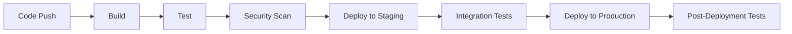

# CI/CD Pipeline and Docker Configuration

## Overview

This document outlines the CI/CD pipeline patterns, GitHub Actions workflows, deployment strategies, and Docker configuration for the Task Management Platform.

## Table of Contents

1. [CI/CD Pipeline Overview](#cicd-pipeline-overview)
2. [GitHub Actions Workflows](#github-actions-workflows)
3. [Docker Configuration](#docker-configuration)
4. [Deployment Strategies](#deployment-strategies)
5. [Environment Management](#environment-management)
6. [Monitoring and Logging](#monitoring-and-logging)

## CI/CD Pipeline Overview

### Pipeline Stages



### Pipeline Principles

1. **Automation**: All stages are automated
2. **Fast Feedback**: Quick build and test cycles
3. **Security**: Security scanning at every stage
4. **Quality Gates**: Automated quality checks
5. **Rollback Capability**: Easy rollback to previous versions

## GitHub Actions Workflows

### Main CI/CD Workflow

```yaml
# .github/workflows/ci-cd.yml
name: CI/CD Pipeline

on:
  push:
    branches: [ main, develop ]
  pull_request:
    branches: [ main ]

env:
  NODE_VERSION: '18'
  JAVA_VERSION: '17'

jobs:
  # Frontend Build and Test
  frontend:
    name: Frontend Build & Test
    runs-on: ubuntu-latest
    
    steps:
    - name: Checkout code
      uses: actions/checkout@v4
      
    - name: Setup Node.js
      uses: actions/setup-node@v4
      with:
        node-version: ${{ env.NODE_VERSION }}
        cache: 'npm'
        cache-dependency-path: client/package-lock.json
        
    - name: Install dependencies
      run: |
        npm ci
        cd client && npm ci
        
    - name: Lint frontend
      run: |
        cd client
        npm run lint
        
    - name: Run frontend tests
      run: |
        cd client
        npm run test:ci
        
    - name: Build frontend
      run: |
        cd client
        npm run build
        
    - name: Upload frontend artifacts
      uses: actions/upload-artifact@v4
      with:
        name: frontend-build
        path: client/dist/
        
  # Backend Build and Test
  backend:
    name: Backend Build & Test
    runs-on: ubuntu-latest
    
    steps:
    - name: Checkout code
      uses: actions/checkout@v4
      
    - name: Setup Java
      uses: actions/setup-java@v4
      with:
        java-version: ${{ env.JAVA_VERSION }}
        distribution: 'temurin'
        
    - name: Cache Maven dependencies
      uses: actions/cache@v4
      with:
        path: ~/.m2
        key: ${{ runner.os }}-m2-${{ hashFiles('**/pom.xml') }}
        restore-keys: ${{ runner.os }}-m2
        
    - name: Build backend
      run: |
        cd server
        mvn clean compile
        
    - name: Run backend tests
      run: |
        cd server
        mvn test
        
    - name: Build JAR
      run: |
        cd server
        mvn package -DskipTests
        
    - name: Upload backend artifacts
      uses: actions/upload-artifact@v4
      with:
        name: backend-build
        path: server/target/*.jar
        
  # Security Scanning
  security:
    name: Security Scan
    runs-on: ubuntu-latest
    needs: [frontend, backend]
    
    steps:
    - name: Checkout code
      uses: actions/checkout@v4
      
    - name: Run Trivy vulnerability scanner
      uses: aquasecurity/trivy-action@master
      with:
        scan-type: 'fs'
        scan-ref: '.'
        format: 'sarif'
        output: 'trivy-results.sarif'
        
    - name: Upload Trivy scan results
      uses: github/codeql-action/upload-sarif@v3
      with:
        sarif_file: 'trivy-results.sarif'
        
  # E2E Tests
  e2e:
    name: E2E Tests
    runs-on: ubuntu-latest
    needs: [frontend, backend]
    
    services:
      postgres:
        image: postgres:15
        env:
          POSTGRES_PASSWORD: postgres
          POSTGRES_DB: testdb
        options: >-
          --health-cmd pg_isready
          --health-interval 10s
          --health-timeout 5s
          --health-retries 5
          
    steps:
    - name: Checkout code
      uses: actions/checkout@v4
      
    - name: Setup Node.js
      uses: actions/setup-node@v4
      with:
        node-version: ${{ env.NODE_VERSION }}
        cache: 'npm'
        
    - name: Install dependencies
      run: npm ci
      
    - name: Download frontend artifacts
      uses: actions/download-artifact@v4
      with:
        name: frontend-build
        
    - name: Download backend artifacts
      uses: actions/download-artifact@v4
      with:
        name: backend-build
        
    - name: Start application
      run: |
        # Start backend
        java -jar server/target/*.jar &
        # Start frontend
        npx serve client/dist/ -p 4200 &
        # Wait for services
        sleep 30
        
    - name: Run E2E tests
      run: |
        cd client
        npm run test:e2e:ci
        
  # Deploy to Staging
  deploy-staging:
    name: Deploy to Staging
    runs-on: ubuntu-latest
    needs: [frontend, backend, security, e2e]
    if: github.ref == 'refs/heads/develop'
    environment: staging
    
    steps:
    - name: Checkout code
      uses: actions/checkout@v4
      
    - name: Download artifacts
      uses: actions/download-artifact@v4
      with:
        name: frontend-build
        
    - name: Download backend artifacts
      uses: actions/download-artifact@v4
      with:
        name: backend-build
        
    - name: Build and push Docker images
      run: |
        docker build -t task-management-frontend:${{ github.sha }} ./client
        docker build -t task-management-backend:${{ github.sha }} ./server
        docker tag task-management-frontend:${{ github.sha }} ${{ secrets.DOCKER_REGISTRY }}/task-management-frontend:staging
        docker tag task-management-backend:${{ github.sha }} ${{ secrets.DOCKER_REGISTRY }}/task-management-backend:staging
        docker push ${{ secrets.DOCKER_REGISTRY }}/task-management-frontend:staging
        docker push ${{ secrets.DOCKER_REGISTRY }}/task-management-backend:staging
        
    - name: Deploy to staging
      run: |
        # Deploy using kubectl or docker-compose
        kubectl set image deployment/task-management-frontend frontend=${{ secrets.DOCKER_REGISTRY }}/task-management-frontend:staging
        kubectl set image deployment/task-management-backend backend=${{ secrets.DOCKER_REGISTRY }}/task-management-backend:staging
        
  # Deploy to Production
  deploy-production:
    name: Deploy to Production
    runs-on: ubuntu-latest
    needs: [deploy-staging]
    if: github.ref == 'refs/heads/main'
    environment: production
    
    steps:
    - name: Checkout code
      uses: actions/checkout@v4
      
    - name: Download artifacts
      uses: actions/download-artifact@v4
      with:
        name: frontend-build
        
    - name: Download backend artifacts
      uses: actions/download-artifact@v4
      with:
        name: backend-build
        
    - name: Build and push Docker images
      run: |
        docker build -t task-management-frontend:${{ github.sha }} ./client
        docker build -t task-management-backend:${{ github.sha }} ./server
        docker tag task-management-frontend:${{ github.sha }} ${{ secrets.DOCKER_REGISTRY }}/task-management-frontend:latest
        docker tag task-management-backend:${{ github.sha }} ${{ secrets.DOCKER_REGISTRY }}/task-management-backend:latest
        docker push ${{ secrets.DOCKER_REGISTRY }}/task-management-frontend:latest
        docker push ${{ secrets.DOCKER_REGISTRY }}/task-management-backend:latest
        
    - name: Deploy to production
      run: |
        # Deploy using kubectl or docker-compose
        kubectl set image deployment/task-management-frontend frontend=${{ secrets.DOCKER_REGISTRY }}/task-management-frontend:latest
        kubectl set image deployment/task-management-backend backend=${{ secrets.DOCKER_REGISTRY }}/task-management-backend:latest
        
    - name: Run post-deployment tests
      run: |
        # Run smoke tests
        curl -f http://production-url/health
        curl -f http://production-url/api/health
```

### Pull Request Workflow

```yaml
# .github/workflows/pull-request.yml
name: Pull Request Checks

on:
  pull_request:
    branches: [ main, develop ]

jobs:
  validate:
    name: Validate PR
    runs-on: ubuntu-latest
    
    steps:
    - name: Checkout code
      uses: actions/checkout@v4
      
    - name: Check PR title format
      uses: amannn/action-semantic-pull-request@v5
      env:
        GITHUB_TOKEN: ${{ secrets.GITHUB_TOKEN }}
      with:
        types: |
          feat
          fix
          docs
          style
          refactor
          test
          chore
        requireScope: false
        
    - name: Check for conventional commits
      uses: TriPSs/conventional-changelog-action@v3
      with:
        githubToken: ${{ secrets.GITHUB_TOKEN }}
        gitUserName: 'github-actions[bot]'
        gitUserEmail: 'github-actions[bot]@users.noreply.github.com'
        preset: 'angular'
        tagPrefix: 'v'
        outputFile: 'CHANGELOG.md'
        skipVersionFile: true
        skipCommit: true
        skipTag: true
```

### Release Workflow

```yaml
# .github/workflows/release.yml
name: Release

on:
  push:
    tags:
      - 'v*'

jobs:
  release:
    name: Create Release
    runs-on: ubuntu-latest
    
    steps:
    - name: Checkout code
      uses: actions/checkout@v4
      
    - name: Generate changelog
      uses: TriPSs/conventional-changelog-action@v3
      with:
        githubToken: ${{ secrets.GITHUB_TOKEN }}
        gitUserName: 'github-actions[bot]'
        gitUserEmail: 'github-actions[bot]@users.noreply.github.com'
        preset: 'angular'
        tagPrefix: 'v'
        outputFile: 'CHANGELOG.md'
        skipVersionFile: true
        skipCommit: true
        skipTag: true
        
    - name: Create Release
      uses: actions/create-release@v1
      env:
        GITHUB_TOKEN: ${{ secrets.GITHUB_TOKEN }}
      with:
        tag_name: ${{ github.ref }}
        release_name: Release ${{ github.ref }}
        body_path: CHANGELOG.md
        draft: false
        prerelease: false
```

## Docker Configuration

### Frontend Dockerfile

```dockerfile
# client/Dockerfile
# Multi-stage build for production
FROM node:18-alpine AS builder

# Set working directory
WORKDIR /app

# Copy package files
COPY package*.json ./
COPY client/package*.json ./client/

# Install dependencies
RUN npm ci
RUN cd client && npm ci

# Copy source code
COPY . .

# Build application
RUN cd client && npm run build

# Production stage
FROM nginx:alpine

# Copy built application
COPY --from=builder /app/client/dist /usr/share/nginx/html

# Copy nginx configuration
COPY client/nginx.conf /etc/nginx/nginx.conf

# Expose port
EXPOSE 80

# Health check
HEALTHCHECK --interval=30s --timeout=3s --start-period=5s --retries=3 \
  CMD curl -f http://localhost/health || exit 1

# Start nginx
CMD ["nginx", "-g", "daemon off;"]
```

### Backend Dockerfile

```dockerfile
# server/Dockerfile
# Multi-stage build for production
FROM maven:3.9-openjdk-17 AS builder

# Set working directory
WORKDIR /app

# Copy pom.xml
COPY server/pom.xml .

# Download dependencies
RUN mvn dependency:go-offline -B

# Copy source code
COPY server/src ./src

# Build application
RUN mvn clean package -DskipTests

# Production stage
FROM openjdk:17-jre-alpine

# Create app user
RUN addgroup -g 1001 -S appgroup && \
    adduser -u 1001 -S appuser -G appgroup

# Set working directory
WORKDIR /app

# Copy JAR file
COPY --from=builder /app/target/*.jar app.jar

# Change ownership
RUN chown appuser:appgroup app.jar

# Switch to non-root user
USER appuser

# Expose port
EXPOSE 8080

# Health check
HEALTHCHECK --interval=30s --timeout=3s --start-period=60s --retries=3 \
  CMD curl -f http://localhost:8080/actuator/health || exit 1

# Start application
ENTRYPOINT ["java", "-jar", "app.jar"]
```

### Docker Compose Configuration

```yaml
# docker-compose.yml
version: '3.8'

services:
  # Frontend
  frontend:
    build:
      context: ./client
      dockerfile: Dockerfile
    ports:
      - "80:80"
    depends_on:
      - backend
    environment:
      - API_BASE_URL=http://backend:8080/api
    networks:
      - app-network
    restart: unless-stopped

  # Backend
  backend:
    build:
      context: ./server
      dockerfile: Dockerfile
    ports:
      - "8080:8080"
    depends_on:
      - postgres
      - redis
    environment:
      - SPRING_PROFILES_ACTIVE=docker
      - SPRING_DATASOURCE_URL=jdbc:postgresql://postgres:5432/taskdb
      - SPRING_DATASOURCE_USERNAME=taskuser
      - SPRING_DATASOURCE_PASSWORD=taskpass
      - SPRING_REDIS_HOST=redis
      - SPRING_REDIS_PORT=6379
    networks:
      - app-network
    restart: unless-stopped

  # Database
  postgres:
    image: postgres:15-alpine
    environment:
      - POSTGRES_DB=taskdb
      - POSTGRES_USER=taskuser
      - POSTGRES_PASSWORD=taskpass
    volumes:
      - postgres_data:/var/lib/postgresql/data
      - ./server/src/main/resources/db/init.sql:/docker-entrypoint-initdb.d/init.sql
    ports:
      - "5432:5432"
    networks:
      - app-network
    restart: unless-stopped

  # Redis Cache
  redis:
    image: redis:7-alpine
    ports:
      - "6379:6379"
    volumes:
      - redis_data:/data
    networks:
      - app-network
    restart: unless-stopped

  # Nginx Reverse Proxy
  nginx:
    image: nginx:alpine
    ports:
      - "443:443"
      - "80:80"
    volumes:
      - ./nginx/nginx.conf:/etc/nginx/nginx.conf
      - ./nginx/ssl:/etc/nginx/ssl
    depends_on:
      - frontend
      - backend
    networks:
      - app-network
    restart: unless-stopped

volumes:
  postgres_data:
  redis_data:

networks:
  app-network:
    driver: bridge
```

### Development Docker Compose

```yaml
# docker-compose.dev.yml
version: '3.8'

services:
  # Frontend Development
  frontend-dev:
    build:
      context: ./client
      dockerfile: Dockerfile.dev
    ports:
      - "4200:4200"
    volumes:
      - ./client:/app
      - /app/node_modules
    environment:
      - NODE_ENV=development
    command: npm start
    networks:
      - app-network

  # Backend Development
  backend-dev:
    build:
      context: ./server
      dockerfile: Dockerfile.dev
    ports:
      - "8080:8080"
    volumes:
      - ./server:/app
    environment:
      - SPRING_PROFILES_ACTIVE=dev
      - SPRING_DATASOURCE_URL=jdbc:h2:mem:testdb
    command: mvn spring-boot:run
    networks:
      - app-network

  # Development Database
  postgres-dev:
    image: postgres:15-alpine
    environment:
      - POSTGRES_DB=taskdb_dev
      - POSTGRES_USER=devuser
      - POSTGRES_PASSWORD=devpass
    ports:
      - "5433:5432"
    volumes:
      - postgres_dev_data:/var/lib/postgresql/data
    networks:
      - app-network

volumes:
  postgres_dev_data:

networks:
  app-network:
    driver: bridge
```

## Deployment Strategies

### Blue-Green Deployment

```yaml
# kubernetes/blue-green-deployment.yaml
apiVersion: apps/v1
kind: Deployment
metadata:
  name: task-management-backend-blue
spec:
  replicas: 3
  selector:
    matchLabels:
      app: task-management-backend
      version: blue
  template:
    metadata:
      labels:
        app: task-management-backend
        version: blue
    spec:
      containers:
      - name: backend
        image: task-management-backend:blue
        ports:
        - containerPort: 8080
        env:
        - name: SPRING_PROFILES_ACTIVE
          value: "production"
---
apiVersion: v1
kind: Service
metadata:
  name: task-management-backend-blue
spec:
  selector:
    app: task-management-backend
    version: blue
  ports:
  - port: 8080
    targetPort: 8080
---
apiVersion: v1
kind: Service
metadata:
  name: task-management-backend-green
spec:
  selector:
    app: task-management-backend
    version: green
  ports:
  - port: 8080
    targetPort: 8080
```

### Rolling Update Strategy

```yaml
# kubernetes/rolling-update.yaml
apiVersion: apps/v1
kind: Deployment
metadata:
  name: task-management-backend
spec:
  replicas: 5
  strategy:
    type: RollingUpdate
    rollingUpdate:
      maxSurge: 1
      maxUnavailable: 0
  selector:
    matchLabels:
      app: task-management-backend
  template:
    metadata:
      labels:
        app: task-management-backend
    spec:
      containers:
      - name: backend
        image: task-management-backend:latest
        ports:
        - containerPort: 8080
        readinessProbe:
          httpGet:
            path: /actuator/health
            port: 8080
          initialDelaySeconds: 30
          periodSeconds: 10
        livenessProbe:
          httpGet:
            path: /actuator/health
            port: 8080
          initialDelaySeconds: 60
          periodSeconds: 30
```

## Environment Management

### Environment Configuration

```yaml
# config/environments.yaml
environments:
  development:
    frontend:
      api_url: http://localhost:8080/api
      environment: development
      enable_analytics: false
    backend:
      database_url: jdbc:h2:mem:devdb
      database_username: sa
      database_password: 
      redis_host: localhost
      redis_port: 6379
      
  staging:
    frontend:
      api_url: https://api-staging.example.com/api
      environment: staging
      enable_analytics: true
    backend:
      database_url: jdbc:postgresql://staging-db:5432/taskdb
      database_username: taskuser
      database_password: ${DB_PASSWORD}
      redis_host: staging-redis
      redis_port: 6379
      
  production:
    frontend:
      api_url: https://api.example.com/api
      environment: production
      enable_analytics: true
    backend:
      database_url: jdbc:postgresql://prod-db:5432/taskdb
      database_username: taskuser
      database_password: ${DB_PASSWORD}
      redis_host: prod-redis
      redis_port: 6379
```

### Secrets Management

```yaml
# kubernetes/secrets.yaml
apiVersion: v1
kind: Secret
metadata:
  name: task-management-secrets
type: Opaque
data:
  database-password: <base64-encoded-password>
  jwt-secret: <base64-encoded-jwt-secret>
  api-key: <base64-encoded-api-key>
---
apiVersion: v1
kind: ConfigMap
metadata:
  name: task-management-config
data:
  application.yml: |
    spring:
      datasource:
        url: jdbc:postgresql://postgres:5432/taskdb
        username: taskuser
      redis:
        host: redis
        port: 6379
      jpa:
        hibernate:
          ddl-auto: validate
        show-sql: false
```

## Monitoring and Logging

### Prometheus Configuration

```yaml
# monitoring/prometheus.yml
global:
  scrape_interval: 15s

scrape_configs:
  - job_name: 'task-management-backend'
    static_configs:
      - targets: ['backend:8080']
    metrics_path: '/actuator/prometheus'
    
  - job_name: 'task-management-frontend'
    static_configs:
      - targets: ['frontend:80']
    metrics_path: '/metrics'
```

### Grafana Dashboard

```json
// monitoring/grafana-dashboard.json
{
  "dashboard": {
    "title": "Task Management Platform",
    "panels": [
      {
        "title": "HTTP Request Rate",
        "type": "graph",
        "targets": [
          {
            "expr": "rate(http_requests_total[5m])",
            "legendFormat": "{{method}} {{endpoint}}"
          }
        ]
      },
      {
        "title": "Response Time",
        "type": "graph",
        "targets": [
          {
            "expr": "histogram_quantile(0.95, rate(http_request_duration_seconds_bucket[5m]))",
            "legendFormat": "95th percentile"
          }
        ]
      },
      {
        "title": "Error Rate",
        "type": "graph",
        "targets": [
          {
            "expr": "rate(http_requests_total{status=~\"5..\"}[5m])",
            "legendFormat": "5xx errors"
          }
        ]
      }
    ]
  }
}
```

### Logging Configuration

```yaml
# logging/logback-spring.xml
<?xml version="1.0" encoding="UTF-8"?>
<configuration>
  <springProfile name="production">
    <appender name="STDOUT" class="ch.qos.logback.core.ConsoleAppender">
      <encoder class="net.logstash.logback.encoder.LoggingEventCompositeJsonEncoder">
        <providers>
          <timestamp/>
          <logLevel/>
          <loggerName/>
          <message/>
          <mdc/>
          <stackTrace/>
        </providers>
      </encoder>
    </appender>
    
    <appender name="FILE" class="ch.qos.logback.core.rolling.RollingFileAppender">
      <file>/var/log/task-management/application.log</file>
      <rollingPolicy class="ch.qos.logback.core.rolling.TimeBasedRollingPolicy">
        <fileNamePattern>/var/log/task-management/application.%d{yyyy-MM-dd}.log</fileNamePattern>
        <maxHistory>30</maxHistory>
      </rollingPolicy>
      <encoder class="net.logstash.logback.encoder.LoggingEventCompositeJsonEncoder">
        <providers>
          <timestamp/>
          <logLevel/>
          <loggerName/>
          <message/>
          <mdc/>
          <stackTrace/>
        </providers>
      </encoder>
    </appender>
    
    <root level="INFO">
      <appender-ref ref="STDOUT"/>
      <appender-ref ref="FILE"/>
    </root>
  </springProfile>
</configuration>
```

This comprehensive CI/CD pipeline configuration provides automated building, testing, security scanning, and deployment capabilities for the Task Management Platform.
